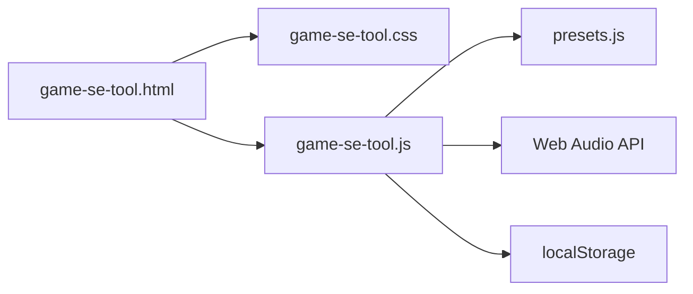

# Game SE Tool — アーキテクチャ・チートシート

このドキュメントは **AI・開発者が全体を読まずに改修できる** ための短い地図です。作業範囲に応じて **当該ファイルだけ** を開くとトークン消費を抑えられます。

## ファイル構成（分割後）

| ファイル | 役割 | ざっくり行数目安 |
|----------|------|------------------|
| `game-se-tool.html` | マークアップ。エントリは `<script type="module" src="game-se-tool.js">` | ~370 |
| `game-se-tool.css` | 全スタイル（レイアウト・モーダル・アルペジオ・ピッチSEQ・Temp Board 等） | ~1240 |
| `presets.js` | 内蔵プリセット **`export const PRESETS`** のみ | ~65 |
| `game-se-tool.js` | `import { PRESETS } from './presets.js'` 以降のロジック一式 | ~1290＋`window` 公開ブロック |

**配布:** 本番は **HTTPS 上の静的ホスト** を想定（一般公開向け）。`file://` 直開きは ES modules の都合で不安定になり得る — ローカル確認は `npx serve` 等。

**インライン `onclick`:** モジュールはトップレベルを `window` に載せないため、HTML から呼ぶ関数は `game-se-tool.js` 末尾の **`Object.assign(window, { ... })`** で公開している。

---

## データフローの骨格

- **単発再生:** `playSE()` → `initAudio()` → `playSEOnCtx(audioCtx, masterGain, state)`
- **波形表示:** `drawWaveform()` が `requestAnimationFrame` でキャンバスを更新（`analyser` 参照）
- **エディタ:** スライダーは主に `updateParam(id, val)` で `state` とラベル DOM を同期（値表示の id は通常 `v`+PascalCase(`id`) だが、`frequency`→`vFreq` など省略形は `game-se-tool.js` の `labelElIds` で対応）

---

## グローバル状態・定数（`game-se-tool.js` 先頭付近）

| 名前 | 意味 |
|------|------|
| `state` | 現在の SE パラメータ（wave, ADSR, filter, FX, duration, volume） |
| `PRESETS` | `presets.js` から import。カテゴリ `8bit` / `real` / `ui` / `env` |
| `audioCtx`, `analyser`, `masterGain` | メインの AudioContext と可視化・出力 |
| `currentCategory`, `activePreset` | 左サイドバーのカテゴリと選択中プリセット名 |
| `CMP` | SE 比較モーダル用スロット（最大4） |
| `ARP` | アルペジエータの BPM・グリッド・タイマー状態 |
| `PSEQ` | ピッチシーケンサの状態 |
| `tbCards` | Temp Board（`localStorage` キー `gameSETempBoard`） |

HTML から `onclick="..."` で呼ばれる関数は **`Object.assign(window, …)`** で公開（`<script type="module">` 対応）。

---

## `game-se-tool.js` セクション境界（目印コメント）

作業テーマ別に **このあたりだけ** 読めば足りることが多いです。

| テーマ | 開始行（目安） | 主な関数・識別子 |
|--------|----------------|------------------|
| Audio コア・書き出し | ~1–400 | `initAudio`, `playSEOnCtx`, `makeNoise`, `makeConvolver`, `exportWAV`, `encodeWAV`, `drawWaveform` |
| プリセット UI・`state` 同期 | `PRESETS` 直後〜 | `loadPreset`, `renderPresets`, `setCategory`, `randomize`, `updateParam`, `setWave` |
| SE 比較 | ~405 (`// ── SE Compare`) | `CMP`, `cmpAddSlot`, `cmpRender`, `openCompare`, `closeCompare`, … |
| Pitch Sequencer | ~609 (`// ── Pitch Sequencer`) | `PSEQ`, `pseqStart`, `pseqStop`, `pseqTick`, `togglePseq`, … |
| Arpeggiator | ~825 (`// ── Arpeggiator`) | `ARP`, `arpStart`, `arpStop`, `arpRenderGrid`, … |
| ユーザプリセット JSON | ~961 (`// ── JSON Preset Manager`) | `openManager`, `saveCurrentPreset`, `importJSON`, `exportAllJSON`, … |
| Temp Board | ~1107 (`// ── Temp Board`) | `tbAdd`, `tbRender`, `tbPlay`, `TB_KEY` |
| 初期化・ショートカット | ファイル末尾付近 | `renderPresets(); drawWaveform(); initArp(); initPseq(); initTb();` と `keydown` リスナ |

（行番号は軽微な編集でズレるので、迷ったら `// ──` で `grep` する。）

---

## レスポンシブ（モバイルタブ）

- **ブレークポイント:** `max-width: 900px`（`game-se-tool.css` 末尾付近）
- **DOM:** 下部 `.mobile-tabbar`（`game-se-tool.html`）、メインレイアウトに `id="appLayout"`。
- **切替:** 狭い幅では `#appLayout` に `data-mobile-tab="presets" | "edit" | "tools"` を付与。表示は CSS で各ペインの `display` を切り替え。`game-se-tool.js` の `syncMobileTabUI` / `MOBILE_TAB_MQ` がリサイズ時に同期。
- **既定タブ（モバイル初回）:** `presets`

---

## `game-se-tool.css` の見分け方

単一ファイルのため **クラス名プレフィックス** でブロックを把握するのが早いです。

| プレフィックス | UI 領域 |
|----------------|---------|
| `.layout`, `.sidebar`, `.preset-*` | 左：カテゴリ・プリセット一覧 |
| `.center`, `.visualizer-*`, `.editor-*`, `.wave-*` | 中央：波形・パラメータ |
| `.arp-*` | アルペジエータパネル |
| `.pseq-*` | ピッチシーケンサ |
| `.right` / `.tboard*` / `.tcard-*` | 右：Temp Board |
| `.modal-*`, `.save-*` | プリセットマネージャモーダル |
| `.cmp-*` | SE 比較オーバーレイ |

---

## `game-se-tool.html` — 主要 DOM id（抜粋）

レイアウトやスクリプトから `getElementById` される核だけ。

- **キャンバス:** `canvas`（メイン波形）
- **スライダー群:** `attack`, `decay`, `sustain`, `release`, `frequency`, `sweep`, `cutoff`, `resonance`, `distortion`, `reverb`, `vibrato`, `duration`, `volume`
- **アルペジオ:** `arpGrid`, `arpBpm`, `arpDiv`, `arpSteps`, …
- **ピッチSEQ:** `pseqPanel`, `pseqGrid`, `pseqBpm`, …
- **モーダル:** `modalOverlay`, `savePresetName`, `savedPresetList`, `cmpOverlay`, `cmpBody`
- **Temp Board:** `tbList`
- **トースト:** `toast`

---

## キーボードショートカット（`game-se-tool.js` 末尾）

入力フォーカス中は大部分スキップ。`Escape` はモーダル停止・ARP/PSEQ 停止。

| キー | 動作（概要） |
|------|----------------|
| Space | 再生 / ARP・PSEQ 動作中は停止優先の分岐あり |
| R | ランダム |
| S | プリセットマネージャ |
| T | Temp Board に追加 |
| C | 比較スロットに追加 |
| A | アルペジオ開始/停止 |
| P | ピッチSEQ パネル表示トグル + 再生制御 |

---

## さらにファイルを分けたい場合（オプション）

現状は **`presets.js` 分離 + ES module** まで。追加候補（**依存順・`window` 追加分**に注意）:

1. `audio-engine.js` — `playSEOnCtx` / WAV エンコード
2. `arp.js` / `pseq.js` / `compare.js` / `temp-board.js` — 各 `// ──` ブロックを切り出し

分割時は **グローバル参照**（`state` / `showToast` 等）の循環に注意。公開 Web 配布では HTTP(S) オリジンで問題になりにくい。

---

## バージョン管理（Git / GitHub）

- 本プロジェクトは **Git** でリポジトリルートを管理する。**GitHub への新規リポジトリ作成・`remote`・初回 `push`** の手順は **[README.md](./README.md)** に記載。
- 作業メモ用の **覚書.txt** は `.gitignore` で除外（個人用の_scratch をコミットしないため）。

---

## 変更履歴（メンテ用）

- Git / `.gitignore` / `README.md`（GitHub 手順）を追加。
- モバイル（≤900px）: 下部タブでプリセット / 編集 / ツールの3ペイン切替。
- `game-se-tool.css` / `game-se-tool.js` / `presets.js` 分離、`type="module"`、本チートシート。
