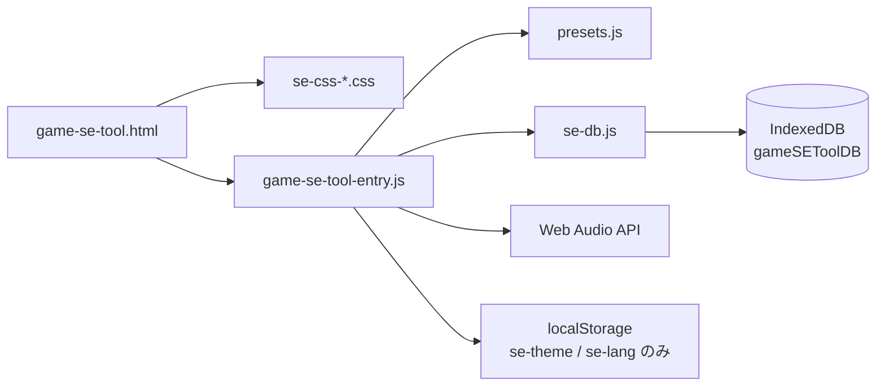

# Game SE Tool — アーキテクチャ・チートシート

このドキュメントは **AI・開発者が全体を読まずに改修できる** ための短い地図です。作業範囲に応じて **当該ファイルだけ** を開くとトークン消費を抑えられます。

## ファイル構成（分割後）

| ファイル | 役割 | 行数 |
|----------|------|------|
| `game-se-tool.html` | マークアップ。エントリは `<script type="module" src="game-se-tool-entry.js">` | ~530 |
| `se-css-core.css` | 共通レイアウト/エディタ/プリセット管理/トースト等（4分割のベース） | ~1190 |
| `se-css-arp.css` | アルペジエータ（ARP）UI スタイル | ~145 |
| `se-css-pseq-compare.css` | ピッチSEQ + SE 比較モーダル | ~340 |
| `se-css-temp-mobile.css` | Temp Board + モバイル（<=900px）の切替UI | ~430 |
| `presets.js` | 内蔵プリセット **`export const PRESETS`** のみ | ~65 |
| `game-se-tool-entry.js` | entry オーケストレータ（`se-*` を import、`window` 公開、初期化） | ~610 |
| `se-state.js` | 共有状態（`state` / `app`）＋ レイヤー操作（`ensureLayers` / `pushActiveToLayers` / `pullLayerToState` / `serializePresetForLibrary` / `applyPresetParamsFromLibrary` 等） | ~220 |
| `se-toast.js` | Toast 表示（`showToast`） | ~15 |
| `se-debug.js` | 開発用ログ（`debugLibrary`）。無効: `window.__SEGENE_DEBUG_LIBRARY = false` | ~15 |
| `se-audio-engine.js` | Web Audio コア（再生/波形/書き出し）。`ensureAudioRunning()` でモバイル向けに `resume` 完了を待つ | ~450 |
| `se-editor-ui.js` | エディタ UI（`updateParam` / `renderPresets` / `randomize` / `applyStateToUI` / レイヤー操作 等） | ~390 |
| `se-library-ui.js` | ライブラリ管理 UI（`refreshLibraryTabs` / `openLibraryModal` / game・subtab の CRUD / drag&drop 並び替え） | ~550 |
| `se-compare.js` | SE 比較モーダル（CMP スロット管理） | ~240 |
| `se-pseq.js` | ピッチシーケンサ（PSEQ） | ~230 |
| `se-arp.js` | アルペジエータ（ARP） | ~160 |
| `se-json-manager.js` | プリセット保存/読込（JSON / IndexedDB / ZIP エクスポート）。サイドバーの読込・削除・リネームは `_resolveAppGameAndSubTab()`（`app` のみ）。マネージャの ZIP 等は `_resolveGameAndSubTabForLibraryModal()` | ~320 |
| `se-temp-board.js` | Temp Board（カード一覧 + drag&drop） | ~200 |
| `se-db.js` | IndexedDB ラッパー（session / userGames / tempBoard）＋ session save スケジューラ | ~480 |
| `se-ai-generator.js` | AI SE ジェネレータ（LLM → 単一 JSON または **レイヤー配列** `layers[]`・オプトイン UI、`applyLayersFromAiParsed` で反映） | ~900 |
| `se-i18n.js` | 国際化（ja / en）。`t()` / `setLang()` / `applyI18n()`。ヘルプ本文も格納 | ~476 |

**配布:** 本番は **HTTPS 上の静的ホスト** を想定（一般公開向け）。`file://` 直開きは ES modules の都合で不安定になり得る — ローカル確認は `npx serve` 等。

**インライン `onclick`:** モジュールはトップレベルを `window` に載せないため、HTML から呼ぶ関数は `game-se-tool-entry.js` 内の **`Object.assign(window, { ... })`** で公開している。

---

## データフローの骨格



- **単発再生:** `playSE()` → `ensureAudioRunning()`（`await audioCtx.resume()`）→ `pushActiveToLayers()` → `playLayersOnCtx(audioCtx, masterGain, state)`
- **波形表示:** `drawWaveform()` が `requestAnimationFrame` でキャンバスを更新（`analyser` 参照）
- **エディタ:** スライダーは主に `updateParam(id, val)` で `state` とラベル DOM を同期（値表示の id は通常 `v`+PascalCase(`id`) だが、`frequency`→`vFreq` など省略形は `se-editor-ui.js` 内の labelElIds で対応）

---

## グローバル状態・定数（`se-state.js`）

| 名前 | 意味 |
|------|------|
| `state` | 現在の SE パラメータ（wave, ADSR, filter, FX, duration, volume）＋ `layers[]` / `activeLayerIndex` |
| `app.currentCategory` | 内蔵プリセットの選択カテゴリ（`8bit` / `real` / `ui` / `env`） |
| `app.activePreset` | 選択中の内蔵プリセット名 |
| `app.activeUserGameId` | 選択中のユーザーゲーム ID（null = 内蔵プリセット表示） |
| `app.activeUserSubTabId` | 選択中のサブタブ ID（null = サブタブ未選択） |
| `SYNTH_PARAM_KEYS` | シンセパラメータのキー一覧（`se-state.js`） |
| `PRESETS` | `presets.js` から import。カテゴリ `8bit` / `real` / `ui` / `env` |
| `audioCtx`, `analyser`, `masterGain` | メインの AudioContext と可視化・出力（`se-audio-engine.js`） |
| `CMP` | SE 比較モーダル用スロット（最大4） |
| `ARP` | アルペジエータの BPM・グリッド・タイマー状態 |
| `PSEQ` | ピッチシーケンサの状態 |
| `tbCards` | Temp Board（IndexedDB `tempBoard` ストア） |

**`se-state.js` の主な関数:**

| 関数 | 役割 |
|------|------|
| `ensureLayers()` | `state.layers` が空なら Layer 1 を初期化 |
| `pushActiveToLayers()` | 現在の `state` の synth パラメータをアクティブレイヤーに書き込み |
| `pullLayerToState(idx)` | 指定レイヤーの synth パラメータを `state` に展開 |
| `replaceLayersWithSingleFromFlat()` | フラットプリセット読込後に単一レイヤーへ収束 |
| `serializePresetForLibrary()` | 保存用シリアライズ（`presetVersion:2` + `layers[]`） |
| `applyPresetParamsFromLibrary(params)` | プリセット読込時に `state` へ適用（v1/v2 両対応） |
| `normalizePresetParamsForStorage(raw)` | 任意の params を保存形式に正規化 |
| `applyLayersFromAiParsed(rows)` | AI 生成のレイヤー配列を `state.layers` に適用 |

HTML から `onclick="..."` で呼ばれる関数は **`game-se-tool-entry.js` の `Object.assign(window, …)`** で公開（`<script type="module">` 対応）。

---

## IndexedDB 永続化（`se-db.js`）

DB 名: `gameSEToolDB` (version 3)

| ObjectStore | keyPath | 内容 |
|-------------|---------|------|
| `session` | `id='current'` | SE パラメータ・カテゴリ・パネル幅・ARP/PSEQ 全設定・アクティブ選択 |
| `userGames` | `id` | ユーザーライブラリ（game → subtabs → items の階層構造） |
| `tempBoard` | `id='cards'` | Temp Board カード配列 |

`userGames` レコード構造:
```
{ id, name, order, createdAt, updatedAt,
  subtabs: [{ id, name, order, createdAt, updatedAt,
    items: [{ id, name, params, createdAt, updatedAt }] }] }
```

**バージョンアップ方針:** `onupgradeneeded` で全 ObjectStore を削除して再作成（旧形式データを残さない）。

**セッション保存のトリガー:** `scheduleSessionSave()`（debounce 500ms）を各モジュールから呼ぶ。実際の保存関数は `game-se-tool-entry.js` が `setSessionSaver()` で登録する。

**起動時フロー（`game-se-tool-entry.js` の async IIFE）:**
1. `migrateFromLocalStorage()` — 旧 localStorage データを IDB へ移行（初回のみ）
2. デフォルト状態で UI 初期化（`renderPresets` / `initArp` / `initPseq` / `initTb`）
3. `dbRestoreSession()` → `restoreSessionData()` — 前回のセッションを復元
4. `setSessionSaver()` 登録（復元完了後に登録することで復元中の誤保存を防ぐ）

**PSEQ.mutedSteps の扱い:** `Set` 型は保存時に `[...mutedSteps]` で配列化、復元時に `new Set(arr)` で戻す。

---

## モジュール役割（分割後）

テーマ別に **当該 `se-*.js` だけ** を開けば足りる形にしています。

| モジュール | 主な担当 |
|------------|----------|
| `se-audio-engine.js` | WebAudio コア（再生/波形/書き出し）。`ensureAudioRunning()` |
| `se-editor-ui.js` | エディタ UI（`updateParam` / `renderPresets` / `loadPreset` / `randomize` / `applyStateToUI` / レイヤー操作 等） |
| `se-library-ui.js` | ライブラリ管理 UI（`refreshLibraryTabs` / `openLibraryModal` / game・subtab の CRUD / drag&drop 並び替え）。`renderPresets` を `se-editor-ui.js` から import |
| `se-compare.js` | SE 比較モーダル（CMP） |
| `se-pseq.js` | ピッチシーケンサ（PSEQ） |
| `se-arp.js` | アルペジエータ（ARP） |
| `se-json-manager.js` | プリセット保存/読込/JSON入出力/ZIP エクスポート（IDB 経由） |
| `se-temp-board.js` | Temp Board（`tb*` / drag&drop） |
| `se-toast.js` | トースト（`showToast`） |
| `se-db.js` | IndexedDB ラッパー（session / userGames / tempBoard）＋ セッション保存スケジューラ |
| `se-state.js` | 共有状態（`state` / `app`）＋ レイヤー操作全般（`ensureLayers` / `push/pullLayerToState` / `serializePresetForLibrary` / `applyPresetParamsFromLibrary` 等） |
| `se-i18n.js` | 国際化（`t()` / `setLang()` / `applyI18n()`）。`se:langchange` イベントで各モジュールが再描画 |

---

## レスポンシブ（モバイルタブ）

- **ブレークポイント:** `max-width: 900px`（`se-css-temp-mobile.css` 末尾付近）
- **DOM:** 下部 `.mobile-tabbar`（`game-se-tool.html`）、メインレイアウトに `id="appLayout"`。
- **切替:** 狭い幅では `#appLayout` に `data-mobile-tab="presets" | "edit" | "tools"` を付与。表示は CSS で各ペインの `display` を切り替え。`game-se-tool-entry.js` の `syncMobileTabUI` / `MOBILE_TAB_MQ` がリサイズ時に同期。
- **既定タブ（モバイル初回）:** `presets`

### モバイルで再生されない・レイヤーだと特に鳴らないように感じる理由

1. **`AudioContext.resume()` は非同期**  
   モバイル（特に iOS Safari）ではコンテキストが `suspended` のまま起動する。従来コードは `audioCtx.resume()` を **待たず** に直後で `OscillatorNode.start()` 等を呼んでおり、このタイミングずれだけで **無音** になり得る。対策として **`ensureAudioRunning()` で `await audioCtx.resume()` してから** `playLayersOnCtx` / `playSEOnCtx` する（`playSE`・ARP・PSEQ・比較・Temp Board・OGG レンダ系で共通化）。

2. **ユーザージェスチャー外の遅延再生**  
   `setTimeout(() => playSE(), …)`（スライダーの **編集時自動再生**、JSON 読込後の自動再生など）は、ブラウザによっては **タップの連鎖外** とみなされ、`resume` が拒否されたままになる。レイヤー固有のバグではないが、「触ったのに鳴らない」が **自動再生まわり** で増えやすい。

3. **レイヤーはグラフが重い**  
   レイヤーごとに `playSEOnCtx` が走り、`reverb > 0` のとき **レイヤー単位で Convolver** が増える。単層より CPU・メモリ負荷が上がり、低スペック端末では **途切れ・無音に近い挙動** が出やすい（体感として「レイヤーだと壊れやすい」と繋がりやすい）。

---

## CSS ファイルの使い分け

`game-se-tool.html` では `se-css-*.css` を複数読み込みます。

- `se-css-core.css`: レイアウト/エディタ/プリセット管理/トーストなど共通部分
- `se-css-arp.css`: アルペジエータ（ARP）部分
- `se-css-pseq-compare.css`: ピッチSEQ（PSEQ）と SE 比較（CMP）
- `se-css-temp-mobile.css`: Temp Board とモバイル（<=900px）切替UI

---

## `game-se-tool.html` — 主要 DOM id（抜粋）

レイアウトやスクリプトから `getElementById` される核だけ。

- **キャンバス:** `canvas`（メイン波形）
- **スライダー群:** `attack`, `decay`, `sustain`, `release`, `frequency`, `sweep`, `cutoff`, `resonance`, `distortion`, `reverb`, `vibrato`, `duration`, `volume`
- **アルペジオ:** `arpGrid`, `arpBpm`, `arpDiv`, `arpSteps`, …
- **ピッチSEQ:** `pseqPanel`, `pseqGrid`, `pseqBpm`, …
- **モーダル:** `modalOverlay`, `savePresetName`, `savedPresetList`, `cmpOverlay`, `cmpBody`
- **Temp Board:** `tbList`
- **トースト:** `toast`

---

## キーボードショートカット（`game-se-tool-entry.js`）

入力フォーカス中は大部分スキップ。`Escape` はモーダル停止・ARP/PSEQ 停止。

| キー | 動作（概要） |
|------|----------------|
| Space | 再生 / ARP・PSEQ 動作中は停止優先の分岐あり |
| R | ランダム |
| S | プリセットマネージャ |
| T | Temp Board に追加 |
| C | 比較スロットに追加 |
| A | アルペジオ開始/停止 |
| P | ピッチSEQ パネル表示トグル + 再生制御 |

---

## 本ツールの定位・制限（本格SEツールとの比較）

### 音を重ねたりできるか

**レイヤー機能で可能です。** エディタ上部の **LAYERS** で複数レイヤーを追加し、各レイヤーの **Mix**（相対音量）・**遅延(ms)**・**ミュート**を調整します。再生・WAV/MP3/OGG 書き出しは全レイヤーをミックスした結果になります。

- `state.layers[]` … 各要素に `id`, `name`, `mix`, `delayMs`, `muted` とシンセパラメータ（`SYNTH_PARAM_KEYS` と同形）
- `state.activeLayerIndex` … スライダーで編集中のレイヤー
- `playLayersOnCtx()` / `playSE()` … 非ミュートレイヤーを `masterGain` へ合流
- ライブラリ / JSON の `params`: **`serializePresetForLibrary()`**（`presetVersion: 2` + `layers[]` + `volume` + `activeLayerIndex`）または従来の **フラット**（`wave`… + `volume`）。読み込みは **`applyPresetParamsFromLibrary()`**。

### 本格的な SE 作成ツールと何が違うか

| 機能 | 本ツール（Game SE Tool） | 本格 SE ツールの例 |
|------|--------------------------|---------------------|
| **音の重ね合わせ** | ✅ 複数レイヤー（Mix/遅延/ミュート） | ✅ ＋ サンプル取り込みやタイムライン等 |
| **音源** | 合成のみ（Oscillator / Noise） | ✅ サンプル（WAV/MP3）取り込み + 合成の併用 |
| **タイムライン** | ❌ なし（全体の duration のみ） | ✅ 各レイヤーの開始タイミング・キーフレーム |
| **合成方式** | 減算シンセ（filter 中心） | FM・加算・wavetable 等の多様な方式 |
| **エフェクト** | 全体で 1 セット（reverb/distortion） | レイヤー単位・バス単位のエフェクト |
| **書き出し** | 単一 SE を WAV/MP3/OGG | 複数レイヤーをミックスして 1 ファイルに |

### レイヤー実装の要点（コード）

- **状態:** `se-state.js` の `layers` / `activeLayerIndex`、編集時は `pushActiveToLayers()` / 切替時は `pullLayerToState()`
- **再生・書き出し:** `se-audio-engine.js` の `playLayersOnCtx()`、`computeMixDurationSec()`
- **UI:** `se-editor-ui.js` の `renderLayerStrip()`、`game-se-tool.html` の `#layerStrip`

---

## さらにファイルを分けたい場合（オプション）

ロジック（`se-*.js`）と主要CSSは既に分割済みです。

次の候補は、必要になったタイミングで **CSS をさらに微細化**（例: `CMP` / `JSON` / `TempBoard` を個別 CSS に）することです。

---

## バージョン管理（Git / GitHub）

- 本プロジェクトは **Git** でリポジトリルートを管理する。**GitHub への新規リポジトリ作成・`remote`・初回 `push`** の手順は **[README.md](./README.md)** に記載。
- 作業メモ用の **覚書.txt** は `.gitignore` で除外（個人用の_scratch をコミットしないため）。

---

## 国際化（`se-i18n.js`）

- **対応言語:** `ja`（日本語・デフォルト）/ `en`（英語）
- **言語切替:** `setLang()` → localStorage `se-lang` に保存 → `applyI18n()` で `[data-i18n]` / `[data-i18n-placeholder]` / `[data-i18n-title]` 属性を一括更新 → `se:langchange` イベントをディスパッチ
- **動的コンテンツの再描画:** `se-editor-ui.js` / `se-ai-generator.js` 等が `se:langchange` を listen して `renderPresets()` / `_renderExamples()` 等を呼び出す
- **ヘルプ本文:** `se-i18n.js` 内の `_helpJa()` / `_helpEn()` に格納

---

## 変更履歴（メンテ用）

- モバイル無音対策: `se-audio-engine.js` に `ensureAudioRunning()`（`await audioCtx.resume()`）、`playSE` および ARP / PSEQ / 比較 / Temp Board / OGG 周辺で利用。`ARCHITECTURE.md` にモバイル再生の注意を追記。
- Git / `.gitignore` / `README.md`（GitHub 手順）を追加。
- モバイル（≤900px）: 下部タブでプリセット / 編集 / ツールの3ペイン切替。
- `se-css-*.css` / `game-se-tool-entry.js`（`se-*` モジュール群） / `presets.js` の分割、`type="module"`、本チートシート。
- `se-db.js` 追加。IndexedDB（`gameSEToolDB`）で session / userGames / tempBoard を一元管理（DB_VERSION=3）。localStorage は `se-theme` / `se-lang` のみ残存。
- `se-i18n.js` 追加。ja/en 切替、`[data-i18n]` 属性による一括翻訳、`se:langchange` イベント連携。
- `se-editor-ui.js` にライブラリ管理 UI（game→subtab→items 階層、モーダル、drag&drop 並び替え）を追加。
- `se-ai-generator.js` にマルチプロバイダ対応（Google/Groq/OpenAI/Anthropic/OpenRouter）、モデル一覧取得・キャッシュ機能を追加。
- AI 生成: 「レイヤーで生成」ON 時は `SYSTEM_PROMPT_LAYERS` で `layers[]` を返させ、`se-state.js` の `applyLayersFromAiParsed` で `state.layers` を構築（単一モードは従来どおり `replaceLayersWithSingleFromFlat`）。
- `se-json-manager.js` に ZIP エクスポート（サブタブ単位・ゲーム単位）を追加。
- `se-editor-ui.js` のライブラリ管理 UI を `se-library-ui.js` に分離。`_syncSliders()` を内部共通化し重複解消。
