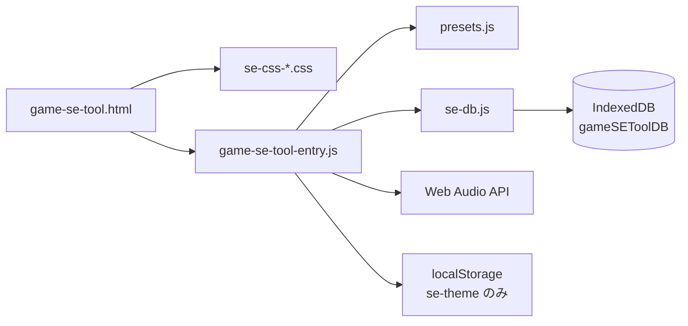

# Game SE Tool — アーキテクチャ・チートシート

このドキュメントは **AI・開発者が全体を読まずに改修できる** ための短い地図です。作業範囲に応じて **当該ファイルだけ** を開くとトークン消費を抑えられます。

## ファイル構成（分割後）

| ファイル | 役割 | ざっくり行数目安 |
|----------|------|------------------|
| `game-se-tool.html` | マークアップ。エントリは `<script type="module" src="game-se-tool-entry.js">` | ~370 |
| `se-css-core.css` | 共通レイアウト/エディタ/プリセット管理/トースト等（4分割のベース） | ~400+ |
| `se-css-arp.css` | アルペジエータ（ARP）UI スタイル | ~4k |
| `se-css-pseq-compare.css` | ピッチSEQ + SE 比較モーダル | ~10k |
| `se-css-temp-mobile.css` | Temp Board + モバイル（<=900px）の切替UI | ~6k |
| `presets.js` | 内蔵プリセット **`export const PRESETS`** のみ | ~65 |
| `game-se-tool-entry.js` | entry オーケストレータ（`se-*` を import、`window` 公開、初期化） | ~310 |
| `se-state.js` | 共有状態（`state` / `app.currentCategory` / `app.activePreset`） | ~40 |
| `se-toast.js` | Toast 表示（`showToast`） | ~15 |
| `se-audio-engine.js` | Web Audio コア（再生/波形/書き出し） | ~300 |
| `se-editor-ui.js` | エディタ UI（`updateParam` / `renderPresets` / `randomize` / `applyStateToUI` 等） | ~280 |
| `se-compare.js` | SE 比較モーダル（CMP スロット管理） | ~250 |
| `se-pseq.js` | ピッチシーケンサ（PSEQ） | ~260 |
| `se-arp.js` | アルペジエータ（ARP） | ~230 |
| `se-json-manager.js` | プリセット保存/読込（JSON / IndexedDB） | ~160 |
| `se-temp-board.js` | Temp Board（カード一覧 + drag&drop） | ~250 |
| `se-db.js` | IndexedDB ラッパー（session / userPresets / tempBoard） | ~130 |

**配布:** 本番は **HTTPS 上の静的ホスト** を想定（一般公開向け）。`file://` 直開きは ES modules の都合で不安定になり得る — ローカル確認は `npx serve` 等。

**インライン `onclick`:** モジュールはトップレベルを `window` に載せないため、HTML から呼ぶ関数は `game-se-tool-entry.js` 内の **`Object.assign(window, { ... })`** で公開している。

---

## データフローの骨格

- **単発再生:** `playSE()` → `initAudio()` → `playSEOnCtx(audioCtx, masterGain, state)`
- **波形表示:** `drawWaveform()` が `requestAnimationFrame` でキャンバスを更新（`analyser` 参照）
- **エディタ:** スライダーは主に `updateParam(id, val)` で `state` とラベル DOM を同期（値表示の id は通常 `v`+PascalCase(`id`) だが、`frequency`→`vFreq` など省略形は `se-editor-ui.js` 内の labelElIds で対応）

---

## グローバル状態・定数（`se-state.js`）

| 名前 | 意味 |
|------|------|
| `state` | 現在の SE パラメータ（wave, ADSR, filter, FX, duration, volume） |
| `app.currentCategory`, `app.activePreset` | 左サイドバーのカテゴリと選択中プリセット名 |
| `PRESETS` | `presets.js` から import。カテゴリ `8bit` / `real` / `ui` / `env` |
| `audioCtx`, `analyser`, `masterGain` | メインの AudioContext と可視化・出力（`se-audio-engine.js`） |
| `CMP` | SE 比較モーダル用スロット（最大4） |
| `ARP` | アルペジエータの BPM・グリッド・タイマー状態 |
| `PSEQ` | ピッチシーケンサの状態 |
| `tbCards` | Temp Board（IndexedDB `tempBoard` ストア） |

HTML から `onclick="..."` で呼ばれる関数は **`game-se-tool-entry.js` の `Object.assign(window, …)`** で公開（`<script type="module">` 対応）。

---
---

## IndexedDB 永続化（`se-db.js`）

DB 名: `gameSEToolDB` (version 1)

| ObjectStore | keyPath | 内容 |
|-------------|---------|------|
| `session` | `id='current'` | SE パラメータ・カテゴリ・パネル幅・ARP/PSEQ 全設定 |
| `userPresets` | `id='list'` | ユーザー保存プリセット配列 |
| `tempBoard` | `id='cards'` | Temp Board カード配列 |

**セッション保存のトリガー:** `scheduleSessionSave()`（debounce 500ms）を各モジュールから呼ぶ。実際の保存関数は `game-se-tool-entry.js` が `setSessionSaver()` で登録する。

**起動時フロー（`game-se-tool-entry.js` の async IIFE）:**
1. `migrateFromLocalStorage()` — 旧 localStorage データを IDB へ移行（初回のみ）
2. デフォルト状態で UI 初期化（`renderPresets` / `initArp` / `initPseq` / `initTb`）
3. `dbRestoreSession()` → `restoreSessionData()` — 前回のセッションを復元
4. `setSessionSaver()` 登録（復元完了後に登録することで復元中の誤保存を防ぐ）

**PSEQ.mutedSteps の扱い:** `Set` 型は保存時に `[...mutedSteps]` で配列化、復元時に `new Set(arr)` で戻す。

---

## モジュール役割（分割後）

テーマ別に **当該 `se-*.js` だけ** を開けば足りる形にしています。

| モジュール | 主な担当 |
|------------|----------|
| `se-audio-engine.js` | WebAudio コア（再生/波形/書き出し） |
| `se-editor-ui.js` | エディタ UI（`updateParam` / `renderPresets` / `loadPreset` 等） |
| `se-compare.js` | SE 比較モーダル（CMP） |
| `se-pseq.js` | ピッチシーケンサ（PSEQ） |
| `se-arp.js` | アルペジエータ（ARP） |
| `se-json-manager.js` | プリセット保存/読込/JSON入出力（IDB 経由） |
| `se-temp-board.js` | Temp Board（`tb*` / drag&drop） |
| `se-toast.js` | トースト（`showToast`） |
| `se-db.js` | IndexedDB ラッパー + セッション保存スケジューラ |
| `se-state.js` | 共有状態（`state` / `app`） |

---

## レスポンシブ（モバイルタブ）

- **ブレークポイント:** `max-width: 900px`（`se-css-temp-mobile.css` 末尾付近）
- **DOM:** 下部 `.mobile-tabbar`（`game-se-tool.html`）、メインレイアウトに `id="appLayout"`。
- **切替:** 狭い幅では `#appLayout` に `data-mobile-tab="presets" | "edit" | "tools"` を付与。表示は CSS で各ペインの `display` を切り替え。`game-se-tool-entry.js` の `syncMobileTabUI` / `MOBILE_TAB_MQ` がリサイズ時に同期。
- **既定タブ（モバイル初回）:** `presets`

---

## CSS ファイルの使い分け

`game-se-tool.html` では `se-css-*.css` を複数読み込みます。

- `se-css-core.css`: レイアウト/エディタ/プリセット管理/トーストなど共通部分
- `se-css-arp.css`: アルペジエータ（ARP）部分
- `se-css-pseq-compare.css`: ピッチSEQ（PSEQ）と SE 比較（CMP）
- `se-css-temp-mobile.css`: Temp Board とモバイル（<=900px）切替UI

---

## `game-se-tool.html` — 主要 DOM id（抜粋）

レイアウトやスクリプトから `getElementById` される核だけ。

- **キャンバス:** `canvas`（メイン波形）
- **スライダー群:** `attack`, `decay`, `sustain`, `release`, `frequency`, `sweep`, `cutoff`, `resonance`, `distortion`, `reverb`, `vibrato`, `duration`, `volume`
- **アルペジオ:** `arpGrid`, `arpBpm`, `arpDiv`, `arpSteps`, …
- **ピッチSEQ:** `pseqPanel`, `pseqGrid`, `pseqBpm`, …
- **モーダル:** `modalOverlay`, `savePresetName`, `savedPresetList`, `cmpOverlay`, `cmpBody`
- **Temp Board:** `tbList`
- **トースト:** `toast`

---

## キーボードショートカット（`game-se-tool-entry.js`）

入力フォーカス中は大部分スキップ。`Escape` はモーダル停止・ARP/PSEQ 停止。

| キー | 動作（概要） |
|------|----------------|
| Space | 再生 / ARP・PSEQ 動作中は停止優先の分岐あり |
| R | ランダム |
| S | プリセットマネージャ |
| T | Temp Board に追加 |
| C | 比較スロットに追加 |
| A | アルペジオ開始/停止 |
| P | ピッチSEQ パネル表示トグル + 再生制御 |

---

## さらにファイルを分けたい場合（オプション）

ロジック（`se-*.js`）と主要CSSは既に分割済みです。

次の候補は、必要になったタイミングで **CSS をさらに微細化**（例: `CMP` / `JSON` / `TempBoard` を個別 CSS に）することです。

---

## バージョン管理（Git / GitHub）

- 本プロジェクトは **Git** でリポジトリルートを管理する。**GitHub への新規リポジトリ作成・`remote`・初回 `push`** の手順は **[README.md](./README.md)** に記載。
- 作業メモ用の **覚書.txt** は `.gitignore` で除外（個人用の_scratch をコミットしないため）。

---

## 変更履歴（メンテ用）

- Git / `.gitignore` / `README.md`（GitHub 手順）を追加。
- モバイル（≤900px）: 下部タブでプリセット / 編集 / ツールの3ペイン切替。
- `se-css-*.css` / `game-se-tool-entry.js`（`se-*` モジュール群） / `presets.js` の分割、`type="module"`、本チートシート。
- `se-db.js` 追加。IndexedDB（`gameSEToolDB`）で session / userPresets / tempBoard を一元管理。localStorage は `se-theme` のみ残存。旧 localStorage データは初回起動時に自動移行。
